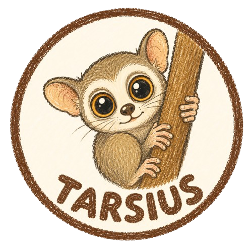

<div align="center">



# Tarsius

### Capture Knowledge That Was Never Written Down. Then Let AI Code.

**A Tacit-Knowledge Capture & Persistence Layer for IBM Bob 2.0**

[](https://ibmdevday-bob.bemyapp.com/)
[](LICENSE)
[](https://arxiv.org/html/2605.17535v1)
[](https://nodejs.org/)
[](https://www.typescriptlang.org/)

</div>

---

> *Like the tarsier primate — the smallest primate with the largest eyes — Tarsius sees the knowledge that exists in no document, no Redbook, no code comment.*
>
> *Bob reads what's written. Tarsius captures what's only in someone's head.*

---

## Table of Contents

- [The Problem](#the-problem)
- [How Tarsius Works](#how-tarsius-works)
- [Why Bob's Built-in Tools Cannot Reach This](#why-bobs-built-in-tools-cannot-reach-this)
- [Key Features](#key-features)
- [Architecture](#architecture)
- [Demo: Two Aha Moments](#demo-two-aha-moments)
- [Research Grounding](#research-grounding)
- [Getting Started](#getting-started)
- [Project Structure](#project-structure)
- [FAQ](#faq)
- [License](#license)

---

## The Problem

**Critical operational knowledge is disappearing from IBM i teams faster than it can be captured — and existing AI tooling cannot recover knowledge that was never externalized in the first place.**

The youngest Baby Boomers (born 1964) are now 62 — already eligible for retirement. When they leave, they don't just take syntax knowledge. They take the undocumented business rules, exceptions, and workarounds that were never written into code comments, technical documentation, or any Redbook. This is **tacit knowledge**: the *"don't touch this field because of a hidden downstream dependency"* kind that only lives in a person's memory.

| Metric | Source | Impact |
|---|---|---|
| **72%** of RPG developers over 50 | Procern 2025 | Retirement wave already underway |
| **#1 concern** (69%) — skills gap beats cybersecurity | Fortra IBM i Survey 2026 | First time in 9 years |
| **66%** of orgs have fewer than 3 IBM i admins | Fortra 2026 | 10% already have zero |
| **9–19%** behavioral equivalence rate | AgentModernize (arXiv:2605.17535) | 81–91% of business logic silently lost |
| **>70%** mainframe exit projects fail | Gartner June 2026 | AI capabilities overestimated |

**The cost is measurable.** Undocumented business logic is the leading cause of failed modernization projects, with 30–50% cost overruns common when teams must reverse-engineer intent from code alone. Once a senior developer retires without a structured handoff, that knowledge gap becomes permanent and unrecoverable.

**This creates a dangerous blind spot for AI-assisted modernization.** Bob's Business Rules Extraction and RAG are highly effective — but only when the answer exists somewhere in writing. When a critical rule was never written down, RAG has nothing to retrieve and code-reading has nothing to extract. The system will confidently generate plausible-looking code that silently violates a rule no one remembered to state.

---

## How Tarsius Works

Tarsius is a structured interview and approval workflow, run as a custom Bob mode with dedicated subagents, that captures tacit knowledge before it's gone — and persists it as a binding contract that constrains all future code generation.

```
WITHOUT TARSIUS                      WITH TARSIUS
┌──────────────────────────┐        ┌──────────────────────────┐
│ Senior engineer retires  │        │ Senior engineer guided   │
│ Knowledge gone forever   │        │ through structured       │
│                          │        │ interview session        │
│ Bob reads code + docs    │        │          ↓               │
│ Bob generates new code   │        │ Tarsius captures rules   │
│ (silently drops rules    │        │ Bob CAN'T see            │
│  no one wrote down)      │        │          ↓               │
│          ↓               │        │ Rules persisted in BRI   │
│ Production bug           │        │ with audit trail         │
│ (months to diagnose)     │        │          ↓               │
│                          │        │ Future AI generation     │
│ 9–19% BER                │        │ constrained by approved  │
│ >70% project failure     │        │ rules only               │
└──────────────────────────┘        └──────────────────────────┘
```

### The Four-Step Workflow

| Step | What Happens | Bob Feature Used |
|---|---|---|
| **1. Capture** | Senior engineer guided through structured review. Surfaces implicit rules Bob's static analysis cannot detect. | Agent Mode, Subagents, Document Understanding |
| **2. Persist** | Approved rules written to a structured, versioned rule ledger (BRI) outside Bob's context window. Immutable hash-based audit trail. | MCP Tools (custom) |
| **3. Reinforce** | Before any code generation, relevant rules are automatically re-injected into Bob's working context — regardless of session boundaries or compaction. | Lifecycle Hooks, MCP Resources, Mode Rules |
| **4. Learn** | A "gotcha memory" stores institutional knowledge — exceptions, legal requirements, and gotchas that persist across sessions. | Gotcha Memory |

---

## Why Bob's Built-in Tools Cannot Reach This

> **Anticipated Judge Question:** *"Why not just use Bob's built-in Business Rules Extraction or RAG?"*

| What Bob Does | The Gap | What Tarsius Adds |
|---|---|---|
| **Business Rules Extraction** reads logic already encoded in source | Cannot extract rules that were never written in code | **Structured interview** surfaces undocumented exceptions |
| **RAG** retrieves answers from documentation and Redbooks | Cannot retrieve knowledge that was never documented | **Tacit knowledge capture** turns person-memory into structured artifact |
| **Context window** starts fresh each session | Rules approved in Session 1 forgotten by Session 5 | **Persistence layer** re-injects rules regardless of session boundaries |
| **Code generation** is unconstrained by prior approvals | AI can silently violate a rule no one stated | **Binding contract** (`RISK-CONTEXT.md`) constrains what AI can generate |
| **Review workflow** is post-generation | Deviations caught after code is written | **Pre-generation governance** catches deviations before code exists |

> **The core insight:** Tarsius is the step that happens *before* extraction and retrieval become possible — turning tacit knowledge into the kind of written artifact that Bob's existing tools can then read, retrieve, and act on with confidence.

---

## Key Features

| Feature | What It Does | Why It Matters |
|---|---|---|
| **Structured Interview Mode** | Guided session surfaces undocumented rules | Captures knowledge that exists in no document |
| **Deterministic Triage 🟢🟡🔴** | 5-condition classifier, zero LLM calls | 50–70% auto-approved — humans review only 🔴 rules |
| **Pre-Generation Binding Contract** | `RISK-CONTEXT.md` constrains what Bob can generate | AI cannot deviate from approved rules |
| **Business Rule Inventory (BRI)** | Structured JSON with triage, confidence, evidence | Enables automated governance |
| **Context Window Persistence** | Rules survive session boundaries and compaction | Knowledge never forgotten between sessions |
| **Decision History** | Hash-based immutable audit trail | Compliance — who approved what, when, and why |
| **Gotcha Memory** | Institutional knowledge accumulates over time | *"Don't remove DISC exception"* — persists forever |
| **Confidence Badge** | AST diff + heuristic verification | Catches AI deviations **before** production |

---

## Architecture

```
┌─────────────────────────────────────────────────────────────┐
│                    IBM Bob 2.0 (Native)                     │
│  Custom Modes · Subagents · Skills · Document Understanding │
│  Lifecycle Hooks · MCP Resources · Mode-Specific Rules      │
└─────────────────────────┬───────────────────────────────────┘
                          │ MCP tool calls
                          ▼
┌─────────────────────────────────────────────────────────────┐
│               TARSIUS PERSISTENCE LAYER                     │
│                                                             │
│  Capture Phase                                              │
│  ├─ Structured interview — surfaces tacit knowledge         │
│  ├─ Subagent parallel extraction — per-function scan        │
│  └─ Document Understanding — cross-reference code vs docs  │
│                                                             │
│  Persist Phase                                              │
│  ├─ write_finding()        — structured rule extraction     │
│  ├─ get_pending_approvals() — filtered rule queue           │
│  └─ mark_approved()        — generate binding contract      │
│                                                             │
│  Reinforce Phase                                            │
│  ├─ Lifecycle hooks — auto-inject rules before every edit   │
│  ├─ MCP Resources  — readable via @mention in Bob           │
│  └─ Mode-specific rules — governance per custom mode        │
│                                                             │
│  Learn Phase                                                │
│  ├─ record_decision() — immutable audit trail               │
│  ├─ check_gotchas()   — institutional knowledge             │
│  └─ Pattern Engine    — auto-tune triage over time          │
└──────────────────────────┬──────────────────────────────────┘
                           ▼
┌─────────────────────────────────────────────────────────────┐
│              Tarsius Dashboard  (React + Vite)              │
│  Risk Triage 🟢🟡🔴 · Rule Cards · Confidence Badge        │
│  Decision History · Gotcha Memory · Code Explorer           │
└─────────────────────────────────────────────────────────────┘
```

---

## Demo: Two Aha Moments

### Aha Moment #1 — Tacit Knowledge Surfaces a Hidden Exception

Bob extracts 4 rules from `ORDVAL.rpgle`. One is flagged 🔴:

> *The documentation says "suspended accounts cannot order." The code says "DISC orders bypass suspension" — an exception from a 2010 class action (CS-4471). These files have been 11 years out of sync. No Redbook mentions this. No code comment explains why. This rule existed **only** in a senior engineer's memory — until Tarsius captured it.*

**The key insight:** Bob's Business Rules Extraction would have read the documentation and generated code that **blocks** suspended DISC orders — silently violating a legally binding exception. Tarsius captured the exception *before* Bob could make that mistake.

### Aha Moment #2 — Persisted Knowledge Constrains Future AI

Developer approves the exception. In a *later* session — after context compaction has summarized the detailed history — Bob's Transformer mode generates new code. The approved rules are automatically re-injected into context via lifecycle hooks. The Confidence Badge drops the moment the AI deviates:

> *Every AI tool can generate code. Tarsius is the only one that captures knowledge that was never written down — and then ensures AI never violates it, even across sessions.*

---

## Research Grounding

Tarsius is grounded in **18 external peer-reviewed papers, empirical studies, and industry reports**:

| # | Finding | Source |
|---|---|---|
| 1 | 9–19% Behavioral Equivalence Rate | AgentModernize (arXiv:2605.17535) |
| 2 | BSG captures 91.2% rules, bottleneck is generation | AgentModernize §V-E |
| 3 | 29% trust AI, 66% verification tax | Stack Overflow 2025 |
| 4 | 84% time spent on non-coding friction | IDC 2025 |
| 5 | LLMs fail at self-review | Articulate but Wrong (arXiv:2605.21537) |
| 6 | Differential fuzzing catches 19–35% non-equivalence | arXiv:2602.15761 |
| 7 | Environment-in-the-Loop required for migration | arXiv:2602.09944 |
| 8 | Metamorphic testing validates equivalence | Kaizen (arXiv:2607.04058) |
| 9 | Differential oracles validate COBOL translation | SEDCoT (arXiv:2607.04092) |
| 10 | Context Rot degrades long-horizon agents | The Ralph Loop |

*Full research table: [docs/research/deep-research-literature.md](docs/research/deep-research-literature.md)*

---

## Getting Started

### Prerequisites

- IBM Bob 2.0 (access provided during hackathon)
- Node.js 18+
- npm

### Quick Start

```bash
# 1. Clone the repository
git clone https://github.com/your-team/tarsius
cd tarsius

# 2. Build the MCP server
cd mcp-server && npm install && npm run build

# 3. Start the dashboard
cd ../dashboard && npm install && npm run dev

# 4. Copy Bob configuration
cp -r templates/.bob .

# 5. Open Bob IDE → select "Legacy Analyzer" mode → start
```

### Run Tests

```bash
npx tsx test/flow-test.ts
# Expected: 33/33 tests passing
```

---

## Project Structure

```
tarsius/
├── .bob/                        # Bob configuration
│   ├── custom_modes.yaml        #   Custom modes (Legacy Analyzer, etc.)
│   ├── mcp.json                 #   MCP server registration
│   ├── rules/                   #   Mode-specific governance rules
│   ├── skills/                  #   Extract / Review / Generate skills
│   └── RISK-CONTEXT.md          #   Active binding contract (approved rules)
│
├── mcp-server/src/
│   ├── tools/                   #   5 MCP tools (write_finding, mark_approved…)
│   ├── bri/                     #   BRI schema, triage classifier, decision store
│   └── verify/                  #   Heuristic verification engine
│
├── dashboard/src/
│   ├── pages/                   #   Dashboard, Business Rules, Risk Map…
│   ├── components/              #   RuleCard, TriageBadge, DecisionHistory…
│   └── hooks/                   #   useBriData (React Query)
│
├── sample-data/
│   ├── ORDVAL.rpgle             #   Legacy RPG source (demo)
│   ├── order-validation-spec.md #   Specification document (demo)
│   ├── tarsius-bri.json         #   Business Rule Inventory
│   ├── tarsius-decisions.json   #   Decision audit trail
│   └── tarsius-gotchas.json     #   Institutional knowledge store
│
├── templates/                   # Bob config templates
├── docs/                        # Documentation and research
└── test/flow-test.ts            # End-to-end test suite (33 tests)
```

---

## FAQ

**Q: Why not just use Bob's built-in Business Rules Extraction?**

Business Rules Extraction reads logic that is already encoded in source code. RAG retrieves answers that already exist in documentation. Both require the knowledge to already be written down somewhere. Tarsius addresses the case neither can reach: knowledge that was never externalized at all, and exists only in a person's memory.

**Q: What happens when the senior engineer retires?**

That's exactly the problem Tarsius solves. The structured interview captures tacit knowledge as a persistent, versioned artifact (BRI + decision history + gotchas). Once captured, the knowledge persists indefinitely — regardless of who leaves the organization.

**Q: How is this different from documentation?**

Traditional documentation is manual, prose-based, and quickly outdated. Tarsius generates structured, timestamped, attributed records automatically — with an immutable audit trail of who approved what, and why. And critically, it captures knowledge that was never documented in the first place.

**Q: Does Tarsius add overhead to the review process?**

No — it makes review *easier*. Without Tarsius, a developer reviews 200 lines of generated code (≈2 hours). With Tarsius, the developer approves a small set of flagged rules (≈5 minutes). The structured interview surfaces the *right* questions upfront, before any code is written.

**Q: How does this work with context compaction?**

Bob's context window gets summarized over long sessions, losing detailed history. Tarsius persists rules *outside* the context window (in BRI JSON files) and re-injects them via lifecycle hooks before every code generation task — regardless of session boundaries.

---

## License

MIT — see [LICENSE](LICENSE)

---

<div align="center">

*Built for the IBM TechXchange 2026 Pre-conference Dev Day Hackathon*


</div>
