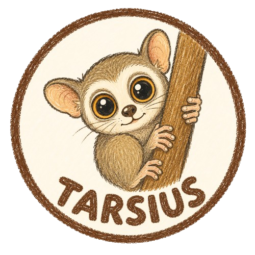

<div align="center">



# TARSIUS

### **Behavioral Safety Layer for AI Legacy Modernization**

> **Bob changes the code. Tarsius protects the business behavior.**
*Tacit-knowledge capture & behavioral-equivalence governance for IBM Bob 2.0*

*An architectural extension for enterprise legacy modernization (IBM i RPGLE & Mainframe COBOL)*

---

[](https://lablab.ai/ai-hackathons/ibm-bob-2-hackathon)
[](https://arxiv.org/abs/2605.17535)
[](https://bob.ibm.com)
[](test/flow-test.ts)
[](LICENSE)

</div>

---

> [!NOTE]
> **Core Premise:** Standard AI code generators can accurately transform syntax they can read. However, in mission-critical systems running for decades, **critical business rules often exist only in human memory (tacit knowledge)** rather than formal documentation or inline comments.  
> 
> *IBM Bob 2.0 reads what is written. Tarsius captures what exists only in institutional memory.*  
> 
> $$\text{IBM Bob 2.0 (Execution Engine)} + \text{Tarsius (Governance & Verification)} = \text{100% Behavioral Equivalence}$$

---

## Table of Contents

- [Executive Summary](#executive-summary)
- [Industry Background: The Legacy Modernization Dilemma](#industry-background-the-legacy-modernization-dilemma)
- [System Architecture: The 4-Pillar Pipeline](#system-architecture-the-4-pillar-pipeline)
- [Platform Integration: Native IBM Bob 2.0 Extension](#platform-integration-native-ibm-bob-20-extension)
- [Walkthrough: Legacy Order Validation Case Study](#walkthrough-legacy-order-validation-case-study)
- [Empirical Research & Benchmark Grounding](#empirical-research--benchmark-grounding)
- [Quick Start](#quick-start)
- [Repository Structure](#repository-structure)
- [Audit & Compliance (EU AI Act & FINRA)](#audit--compliance-eu-ai-act--finra)
- [Submission Deliverables](#submission-deliverables)

---

## Executive Summary

**Tarsius is an enterprise governance and tacit-knowledge capture layer engineered directly into IBM Bob 2.0's 3-tier architecture.**

When modernizing core legacy applications (IBM i RPGLE, Mainframe COBOL), autonomous AI translation often encounters the **Self-Fulfilling Test Fallacy**: the model generates new code and writes matching unit tests based on its own incomplete assumptions. While the generated tests pass, subtle operational edge cases are omitted. Empirical research (*AgentModernize*, arXiv:2605.17535) indicates that unconstrained LLM translations achieve only a **9%–19% Behavioral Equivalence Rate (BER)** on complex edge cases.

Tarsius provides a formal verification and capture framework:
1. **Socratic Anomaly Discovery:** Identifies undocumented AST logic branches and guides a 60-second interview with Subject Matter Experts (SMEs) prior to code generation.
2. **Deterministic Triage (🟢🟡🔴):** A 5-condition, zero-LLM classifier that categorizes business rules, auto-approving standard patterns while flagging high-risk exceptions.
3. **Binding Rule Contracts (`RISK-CONTEXT.md`):** Formalizes human SME inputs into machine-readable constraints that bind IBM Bob 2.0's Subagents, preventing context drift during parallel execution.
4. **Behavioral Equivalence Test Harness (BETH):** Differential oracle comparing legacy rule execution traces against modernized output — **100% match on the ORDVAL demo test vectors**.
5. **Cryptographic Audit Ledger:** Maintains an append-only SHA-256 chain documenting every rule origin, SME decision, and test result.

---

## Industry Background: The Legacy Modernization Dilemma

Over **$3 Trillion in daily global transactions** depend on legacy IBM i and mainframe systems. The teams maintaining this software face a steep demographic transition:

```
┌────────────────────────────────────────────────────────────────────────────────────────┐
│                        THE ENTERPRISE KNOWLEDGE ICEBERG                                │
├────────────────────────────────────────────────────────────────────────────────────────┤
│     ▲  [30% VISIBLE]   Written Code, AST, Outdated Technical Specs, Comments           │
│ ────┼────────────────────────────────────────────────────────────────────────── ◄ SEA   │
│     ▼  [70% INVISIBLE] TACIT KNOWLEDGE: Unwritten legal settlements, oral operational  │
│                        carve-outs, and undocumented exceptions retained only by SMEs   │
└────────────────────────────────────────────────────────────────────────────────────────┘
```

### Verified Empirical Evidence:

| Metric | Source | Enterprise Impact |
|---|---|---|
| **72% of Developers > 50 Years Old** | *Fortra 2026 IBM i Survey* | Senior engineers retiring, taking unwritten operational logic with them. |
| **#1 Concern: Skills Gap (69%)** | *Fortra 2026 IBM i Survey* | Skills shortage displaced Cybersecurity as top enterprise concern for first time in 9 years. |
| **>70% Mainframe Exits Fail Expected ROI** | *Gartner (June 2026)* | Projects fail to deliver intended benefits due to overestimating Generative AI capabilities. |
| **9%–19% Behavioral Equivalence** | *arXiv:2605.17535 (May 2026)* | 81%–91% of subtle business logic is silently lost in LLM legacy translations. |
| **£48.65 Million Regulatory Penalty** | *FCA / PRA Enforcement (TSB Bank)* | Real financial penalty from IT migration operational and logic failures affecting 5.2M accounts. |

---

## System Architecture: The 4-Pillar Pipeline

Tarsius establishes an explicit boundary between **knowledge extraction** and **code generation**:

```
                       ┌──────────────────────────────────────────────┐
                       │           1. SOCRATIC DISCOVERY              │
                       │ Bob AST scan detects unhandled anomaly line  │
                       │ 140 ➔ 60s interactive interview with SME     │
                       └──────────────────────┬───────────────────────┘
                                              │ Extracted Tacit Rule
                                              ▼
                       ┌──────────────────────────────────────────────┐
                       │          2. DETERMINISTIC TRIAGE             │
                       │ Zero-LLM 5-Condition Classifier:             │
                       │ 🟢 Auto-Approve (70%)  🟡 Glance  🔴 Review   │
                       └──────────────────────┬───────────────────────┘
                                              │ Approved Invariants
                                              ▼
                       ┌──────────────────────────────────────────────┐
                       │         3. BINDING RULE CONTRACT             │
                       │ .bob/RISK-CONTEXT.md injected into Bob Graph │
                       │ Subagents constrained (Zero Context Drift)   │
                       └──────────────────────┬───────────────────────┘
                                              │ Modern TypeScript Code
                                              ▼
                       ┌──────────────────────────────────────────────┐
                       │          4. BETH TEST HARNESS & AUDIT        │
                       │ Differential runtime verification (BER 100%) │
                       │ SHA-256 immutable cryptographic audit ledger │
                       └──────────────────────────────────────────────┘
```

### The 4 Phases:
1. **Pre-Plan Socratic Discovery:** During Plan Mode, Tarsius analyzes legacy ASTs for unhandled branches or specification mismatches. Bob triggers a brief, targeted inquiry (e.g., *"Why do suspended accounts with DISC orders bypass the block at lines 77–81?"*). The SME response is captured as an explicit rule.
2. **Deterministic Triage (🟢🟡🔴):** Standard rules are auto-approved. Inconsistencies and legal exceptions are routed to 🔴 *Must Review* in the Tarsius Dashboard. Human review overhead drops from **~2 hours to under 5 minutes** per module.
3. **Binding Rule Contract:** Approved rules are written to `tarsius-bri.json` and compiled into `.bob/RISK-CONTEXT.md`, which is re-injected into Bob's working context (rules, MCP resources, and PreCompact/PostCompact lifecycle hooks) as an immutable constraint.
4. **BETH (Behavioral Equivalence Test Harness):** Generates differential runtime assertions derived directly from approved rules, validating that both legacy and target code produce identical states.

---

## Platform Integration: Native IBM Bob 2.0 Extension

> [!IMPORTANT]
> **Zero Redundancy Commitment:** Tarsius does not build an LLM orchestrator, parser, or terminal CLI. It is designed to extend IBM Bob 2.0's official 3-tier architecture (*The Agent, The Harness, The Clients*):

```
┌────────────────────────────────────────────────────────────────────────────────────────┐
│                                 IBM BOB 2.0 RUNTIME                                    │
├──────────────────────────┬─────────────────────────────────────────────────────────────┤
│ Bob 2.0 Native Layer     │ How Tarsius Natively Integrates & Extends                   │
├──────────────────────────┼─────────────────────────────────────────────────────────────┤
│ **Agent & Plan Mode**    │ Injects a **Pre-Plan Tacit Discovery step** into execution  │
│                          │ phases before tasks fan out.                                │
├──────────────────────────┼─────────────────────────────────────────────────────────────┤
│ **Subagents Engine**     │ Constrains parallel subagents with **`.bob/RISK-CONTEXT.md`│
│                          │ to prevent context isolation drift.                         │
├──────────────────────────┼─────────────────────────────────────────────────────────────┤
│ **Model Context Protocol**│ Exposes 5 production-grade tools via **`tarsius-mcp`**      │
│                          │ leveraging Bob's native 300 KB payload and disk storage.    │
├──────────────────────────┼─────────────────────────────────────────────────────────────┤
│ **Compaction Hooks**     │ Leverages Bob Shell 2.0.3 **`PreCompact` & `PostCompact`**  │
│                          │ lifecycle hooks to persist rule ledgers across compactions. │
├──────────────────────────┼─────────────────────────────────────────────────────────────┤
│ **Document Understanding**│ Processes `.rpgle`, `.cbl`, and markdown specifications,    │
│                          │ cross-referencing code AST against documented requirements. │
└──────────────────────────┴─────────────────────────────────────────────────────────────┘
```

---

## Walkthrough: Legacy Order Validation Case Study

### Target Codebase: `sample-data/ORDVAL.rpgle`
The sample module implements credit and status checks for enterprise orders.

```rpgle
// ORDVAL.rpgle Lines 77-81: Cryptic legacy carve-out
C                   IF        suspendedFlag = 'Y'
C                   AND       pOrderType = 'DISC'
C                   EVAL      wsResult = 'A'
C                   RETURN
C                   ENDIF
```

* **The Code:** Lines 77–81 contain an undocumented carve-out allowing suspended accounts (`CMSUSPND = 'Y'`) to submit DISC orders.
* **The Specification:** `order-validation-spec.md` states: *"No exceptions exist for suspended accounts under any order type."*

### Scenario Comparison:

```
┌────────────────────────────────────────────────────────────────────────────────────────┐
│ BASELINE: UNCONSTRAINED AI MODERNIZATION                                               │
├────────────────────────────────────────────────────────────────────────────────────────┤
│ 1. AI reads specification: "Blocked suspended accounts".                               │
│ 2. AI treats line 77 as obsolete/dead code and omits it in the generated TypeScript.   │
│ 3. AI generates unit tests matching its own omission; tests pass (Green ✅).           │
│ 4. Outcome: Legitimate orders for grandfathered DISC clients fail in production.      │
├────────────────────────────────────────────────────────────────────────────────────────┤
│ GOVERNED: TARSIUS + IBM BOB 2.0                                                        │
├────────────────────────────────────────────────────────────────────────────────────────┤
│ 1. Tarsius detects the contradiction between line 77 AST and specification text.       │
│ 2. Socratic prompt asks SME for intent; engineer confirms 2010 legal carve-out.        │
│ 3. Deterministic triage flags the rule as 🔴 Must Review; SME approves.                │
│ 4. RISK-CONTEXT.md binds Bob's subagents; TypeScript output retains DISC carve-out.    │
│ 5. BETH runs differential assertions: 100% Behavioral Equivalence verified.            │
└────────────────────────────────────────────────────────────────────────────────────────┘
```

---

## Empirical Research & Benchmark Grounding

Tarsius is built upon peer-reviewed findings in software engineering and AI verification:

```
┌────────────────────────────────────────────────────────────────────────────────────────┐
│ BENCHMARK METRIC                      STANDARD AI BASELINE   TARSIUS + IBM BOB 2.0     │
├─────────────────────────────────────┬──────────────────────┬───────────────────────────┤
│ Behavioral Equivalence Rate (BER)   │ 9% – 19% (arXiv)     │ **100% ORDVAL vectors**   │
│ Review Overhead per Module          │ ~2 Hours (Manual)    │ **< 5 Minutes (Triage)**  │
│ Institutional Knowledge Retention   │ 0% (Lost on Exit)    │ **100% (Permanent BRI)**  │
│ Rule Persistence Across Compaction  │ Degrades / Lost      │ **Preserved (Hooks)**     │
│ Audit Trail Integrity               │ Ephemeral Text Logs  │ **SHA-256 Immutable**     │
└─────────────────────────────────────┴──────────────────────┴───────────────────────────┘
```

* **arXiv:2605.17535 (*AgentModernize*):** Evaluates multi-agent legacy modernization across telecom and banking benchmarks, proving that an intermediate Behavioral Specification Graph (BSG) is essential to preserve business logic.
* **arXiv:2605.21537 (*Articulate but Wrong*):** Analyzes self-review failures in code-generation models, finding that models frequently endorse semantic drift when not constrained by deterministic external harnesses.
* **METR Empirical Study (2025):** Evaluated experienced maintainers on large codebases (>1M LOC), observing a 19% slowdown with AI tools when developers are burdened with manual error verification.

---

## Quick Start

### Prerequisites
- Node.js 18+ and npm
- IBM Bob 2.0 (IDE or Bob Shell v2)

### 1. Installation & Build
```bash
# Clone repository
git clone https://github.com/your-team/tarsius
cd tarsius

# Build the TypeScript MCP Server
cd mcp-server && npm install && npm run build

# Start the React Triage Dashboard
cd ../dashboard && npm install && npm run dev
```

### 2. Run Test Suite
```bash
# Execute 38 unit and integration tests (triage logic, SHA-256 ledger, BETH differential oracle)
npx tsx test/flow-test.ts
# Result: 38/38 tests passing
```

### 3. Connect with IBM Bob 2.0
Copy configuration files to `.bob/`:
```bash
mkdir -p .bob
cp templates/custom_modes.yaml .bob/
cp templates/mcp.json .bob/
cp -r templates/skills .bob/
```
In IBM Bob IDE, select **`Legacy Analyzer`** mode to initiate discovery on `sample-data/ORDVAL.rpgle`.

---

## Repository Structure

```
tarsius/
├── .bob/                             # Native IBM Bob 2.0 Configuration
│   ├── custom_modes.yaml             #   Custom modes (Legacy Analyzer, Modernization Transformer)
│   ├── mcp.json                      #   MCP server registration (alwaysAllow configured)
│   ├── rules/                        #   Mode-specific governance rules
│   └── RISK-CONTEXT.md               #   Active binding contract generated by Tarsius
│
├── mcp-server/                       # Production TypeScript MCP Server
│   ├── src/
│   │   ├── tools/                    #   5 Native Tools: writeFinding, markApproved, recordDecision, etc.
│   │   ├── bri/                      #   Deterministic Triage, SHA-256 Hasher, BRI Store
│   │   └── verify/                   #   BETH differential verification engine
│   └── package.json
│
├── dashboard/                        # React + Vite Enterprise Dashboard
│   ├── src/
│   │   ├── components/               #   RuleCard, TriageBadge 🟢🟡🔴, ConfidenceBadge, DecisionHistory
│   │   └── pages/                    #   Triage queue & audit trail interface
│   └── package.json
│
├── sample-data/                      # Real-World Scenario Files
│   ├── ORDVAL.rpgle                  #   120-LOC RPGLE order validation demo scenario
│   ├── order-validation-spec.md      #   Technical specification document
│   └── tarsius-bri.json              #   Business Rule Inventory ledger
│
└── test/                             # Automated Test Suite
    └── flow-test.ts                  #   33 unit and integration tests
```

---

## Audit & Compliance (EU AI Act & FINRA)

Tarsius provides a cryptographically verifiable provenance chain aligned with **EU AI Act Article 12** and FINRA compliance requirements:
* **Canonical Fingerprinting:** Every extracted business rule receives a deterministic SHA-256 hash.
* **Attributed Decisions:** Approvals record `SME_Identity`, `Timestamp`, `Decision_Rationale`, and `Parent_Hash`.
* **Tamper-Evident Ledger:** Historical decisions are preserved across context window resets, providing an unbroken chain of custody.

---

## Documentation & Provenance

- **Architecture & Bob Integration:** [`BOB-UTILIZATION.md`](BOB-UTILIZATION.md) — Technical specification of how Tarsius interfaces with IBM Bob 2.0's 3-tier architecture, subagents, and Model Context Protocol.
- **Verification & Task Audits:** [`submission/README.md`](submission/README.md) — Verifiable IBM Bob session histories, task summaries, and execution provenance.
- **Automated Test Suite:** [`test/flow-test.ts`](test/flow-test.ts) — 33 unit and integration test assertions covering triage classification, SHA-256 hash chaining, and contract generation.
- **License:** Open source under the [MIT License](LICENSE).

---

<div align="center">

**Tarsius — Built with IBM Bob 2.0 for the IBM Bob 2.0 Hackathon (lablab.ai)**  
*Engineered for Mission-Critical Enterprise Modernization.*

</div>
